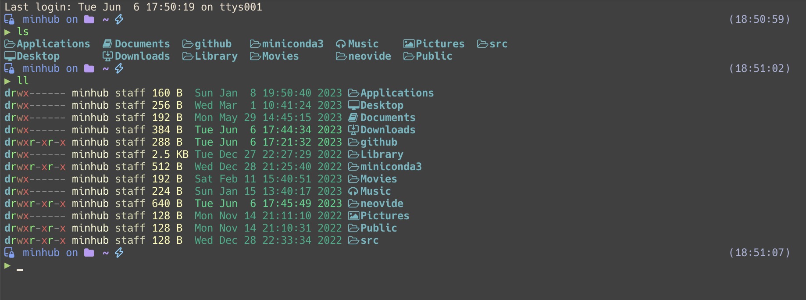
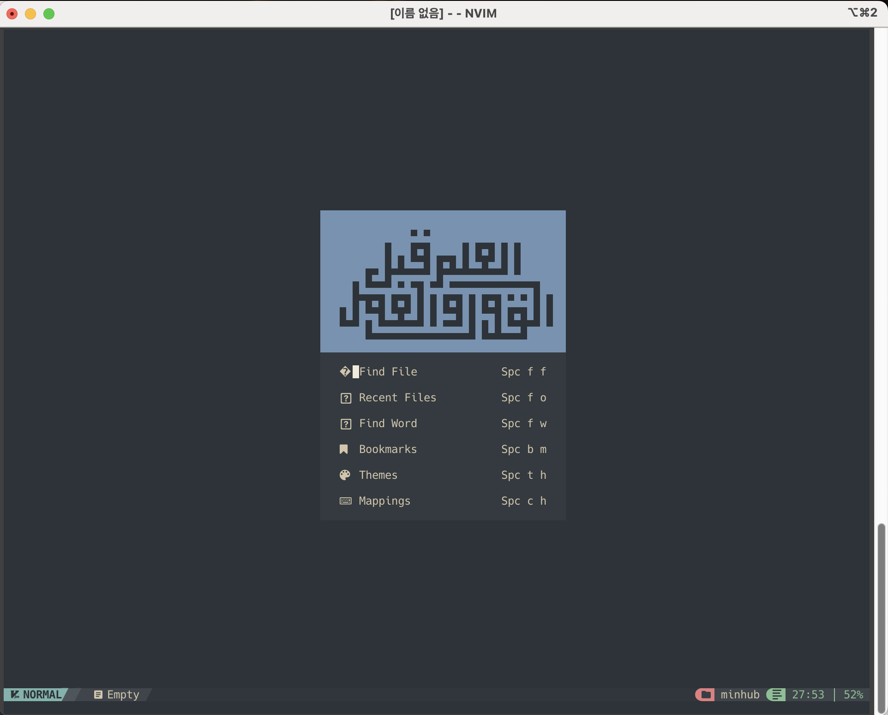

<!-- Improved compatibility of back to top link: See: https://github.com/othneildrew/Best-README-Template/pull/73 -->

<a name="readme-top"></a>

[![MIT License][license-shield]][license-url]

<!-- PROJECT LOGO -->
<br />
<div align="center">
  <a href="https://github.com/minhub7/dotfiles">
    
  </a>

<h3 align="center">dotfiles</h3>
<br />
</div>

<!-- TABLE OF CONTENTS -->
<details>
  <summary>Table of Contents</summary>
  <ol>
    <li>
      <a href="#about-the-project">About The Project</a>
    </li>
    <li>
      <a href="#getting-started">Getting Started</a>
      <ul>
        <li><a href="#prerequisites">Prerequisites</a></li>
        <li><a href="#installation">Installation</a></li>
      </ul>
    </li>
    <li><a href="#roadmap">Roadmap</a></li>
    <li><a href="#license">License</a></li>
    <li><a href="#contact">Contact</a></li>
  </ol>
</details>

<!-- ABOUT THE PROJECT -->

## About The Project

<div align="center">
  
  
</div>

This project is a command prompt configuration for beautiful and powerful
features.

### Built With

- [oh-my-zsh](https://ohmyz.sh/)
- [oh-my-posh](https://ohmyposh.dev/)
- [neovim](https://neovim.io/)
- [tmux](https://github.com/tmux/tmux)

<p align="right">(<a href="#readme-top">back to top</a>)</p>

<!-- GETTING STARTED -->

## Getting Started

### Prerequisites

- snap
- Nodejs
- oh-my-posh
  - zplug (for management oh-my-zsh plugins)
  - oh-my-posh >= 15.4.0
- Neovim >=0.8.1
  - NvChad
- tmux
- Copilot (optional)

1. oh-my-zsh

   you have to install zshell and oh-my-zsh & zplug & oh-my-posh\
   And copy 'zshrc' files to your home directory or make symbolic link\
   If you works on conda environment, modify some codes

2. Neovim

   Recommanded using snap

   ```sh
   sudo apt-get install snap
   snap install nvim --classic
   ```

   or

   ```sh
   sudo add-apt-repository ppa:neovim-ppa/stable
   sudo apt-get update -y
   sudo apt-get install neovim -y
   ```

3. tmux

   Settings for some key bindings in tmux.conf file

### Installation

1. Clone the repo
   ```sh
   git clone https://github.com/minhub7/dotfiles.git
   ```
2. Make symbolic link for zsh & neovim
   ```sh
   cd dotfiles
   ln -s zsh/.zshrc ~/.zshrc
   ln -s nvim.chad/ ~/.config/nvim
   ```
3. Apply the tmux.conf file
   ```sh
   tmux source-file tmux/tmux.conf
   ```

<p align="right">(<a href="#readme-top">back to top</a>)</p>

<!-- ROADMAP -->

## Roadmap

- [x] Change oh-my-zsh to oh-my-posh
  - [x] make custom themes
- [x] Update NvChad
  - [x] change floating terminal size
  - [x] add location in status line (such as row : column)
  - [x] add copilot.lua

<p align="right">(<a href="#readme-top">back to top</a>)</p>

<!-- LICENSE -->

## License

Distributed under the MIT License. See `LICENSE` for more information.

<p align="right">(<a href="#readme-top">back to top</a>)</p>

<!-- CONTACT -->

## Contact

Minho Kim - minhub6@gmail.com

<p align="right">(<a href="#readme-top">back to top</a>)</p>

<!-- MARKDOWN LINKS & IMAGES -->
<!-- https://www.markdownguide.org/basic-syntax/#reference-style-links -->

[license-shield]: https://img.shields.io/github/license/minhub7/dotfiles.svg?style=for-the-badge
[license-url]: https://github.com/minhub7/dotfiles/blob/main/LICENSE
