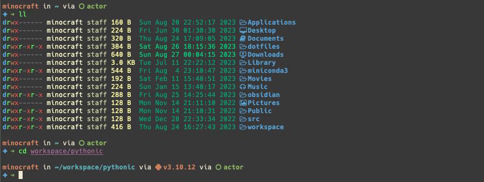

<!-- Improved compatibility of back-to-top link: See: https://github.com/othneildrew/Best-README-Template/pull/73 -->

<a name="readme-top"></a>

[![MIT License][license-shield]][license-url]

<!-- PROJECT LOGO -->
<br />
<div align="center">
  <a href="https://github.com/minocrafft/dotfiles">
    
  </a>

<h3 align="center">dotfiles</h3>
<br />
</div>

<!-- TABLE OF CONTENTS -->
<details>
  <summary>Table of Contents</summary>
  <ol>
    <li><a href="#about-the-project">About The Project</a></li>
    <li><a href="#getting-started">Getting Started</a></li>
    <li><a href="#roadmap">Roadmap</a></li>
    <li><a href="#license">License</a></li>
    <li><a href="#contact">Contact</a></li>
  </ol>
</details>

<!-- ABOUT THE PROJECT -->

## About The Project

<div align="center">
  
  
</div>

This project is a command prompt configuration for beautiful and powerful
features.

### Built With

- [zplug](https://github.com/zplug/zplug)
- [starship](https://starship.rs/)
- [neovim](https://neovim.io/) (with [NvChad](https://nvchad.com))
- [tmux](https://github.com/tmux/tmux)

<p align="right">(<a href="#readme-top">back to top</a>)</p>

<!-- GETTING STARTED -->

## Getting Started

### Prerequisites

_clone the repo_

```sh
git clone https://github.com/minocrafft/dotfiles.git
```

- snap
- Nodejs
- starship
- zsh
  - zplug (for management zsh plugins)
- Neovim == ^0.9.0
- tmux
- Copilot | Codeium (optional)

### zsh

You have to install zshell and zplug and make a symbolic link for a 'zshrc' file.

```shell
ln -s ~/dotfiles/zsh/.zshrc ~/.zshrc
```

### Neovim

_Linux_

```sh
# Recommended using snap
sudo apt-get install snap
snap install nvim --classic

or

sudo add-apt-repository ppa:neovim-ppa/stable
sudo apt-get update -y
sudo apt-get install neovim -y
```

_macOS_

```shell
brew install neovim
```

Clone the NvChad and make a symbolic link for a `nvchad/custom/` dir.

```shell
git clone https://github.com/NvChad/NvChad ~/.config/nvim --depth 1
ln -s ~/dotfiles/nvchad/custom ~/.config/nvim/lua/
```

### Starship

_Linux or macOS_

```shell
curl -sS https://starship.rs/install.sh | sh
```

Add the following to the end of ~/.zshrc:

```shell
eval "$(starship init zsh)"
```

And then, the `starship.toml` file link to `~./config` directory

```shell
ln -s ~/dotfiles/starship.toml ~/.config/starship.toml
```

### tmux

Settings for some key bindings in tmux.conf file
Apply the tmux.conf file

```sh
tmux source-file tmux/tmux.conf
```

<p align="right">(<a href="#readme-top">back to top</a>)</p>

<!-- ROADMAP -->

## Roadmap

- [x] Customize starship.toml
- [ ] Search a useful plugins for zshell

<p align="right">(<a href="#readme-top">back to top</a>)</p>

<!-- LICENSE -->

## License

Distributed under the MIT License. See `LICENSE` for more information.

<p align="right">(<a href="#readme-top">back to top</a>)</p>

<!-- CONTACT -->

## Contact

Minho Kim - minocrafft@gmail.com

<p align="right">(<a href="#readme-top">back to top</a>)</p>

<!-- MARKDOWN LINKS & IMAGES -->
<!-- https://www.markdownguide.org/basic-syntax/#reference-style-links -->

[license-shield]: https://img.shields.io/github/license/minocrafft/dotfiles.svg?style=for-the-badge
[license-url]: https://github.com/minocrafft/dotfiles/blob/main/LICENSE
