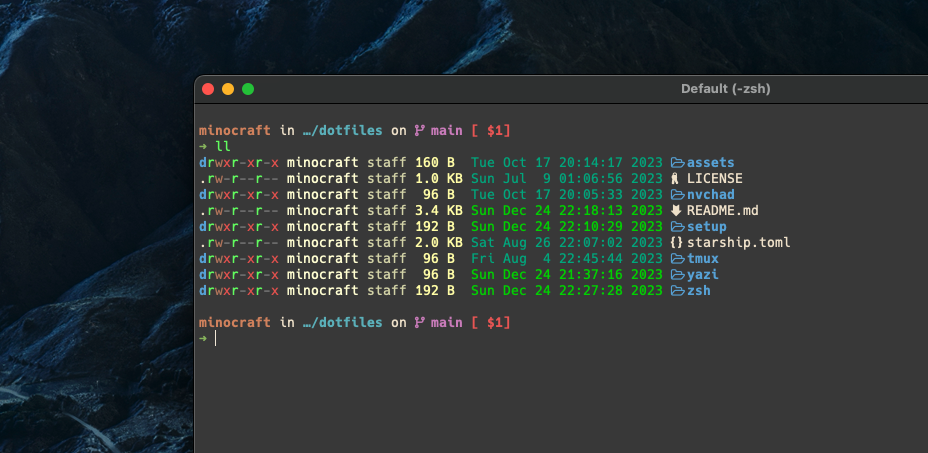
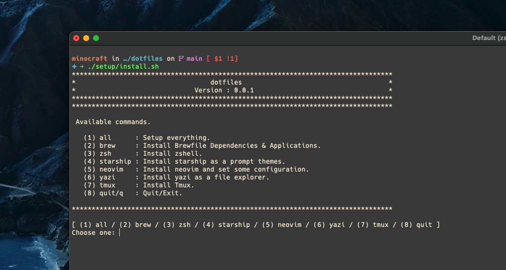

<!-- Improved compatibility of back-to-top link: See: https://github.com/othneildrew/Best-README-Template/pull/73 -->

<a name="readme-top"></a>

[![MIT License][license-shield]][license-url]

<!-- PROJECT LOGO -->
<br />
<div align="center">
  <a href="https://github.com/minocrafft/dotfiles">
    
  </a>

<h3 align="center">dotfiles</h3>
<br />
</div>

<!-- TABLE OF CONTENTS -->
<details>
  <summary>Table of Contents</summary>
  <ol>
    <li><a href="#how-to-use">How to use?</a></li>
    <li><a href="#currently-available-packages">Currently available packages</a></li>
    <li><a href="#how-to-add-other-packages">How to add other packages?</a></li>
    <li><a href="#contact">Contact</a></li>
  </ol>
</details>

<!-- ABOUT THE PROJECT -->

# Welcome to my dotfiles!

<div align="center">
  
</div>

This is a dotfiles for beautiful and powerful features.

## How to use

Just clone this repo

```bash
git clone https://github.com/minocrafft/dotfiles.git

cd dotfiles
```

and run setup/install.sh as a bash, like

```bash
sudo chmod a+x setup/install.sh  # It may require permission to run.

bash setup/install.sh  # or ./setup/install.sh
```

then you can see a screen like this.



Now, you can choose the package you want to install and proceed with the configuration.

#### ⚠️ Cautions

Some installations can be unstable because they were not tested in all environments.

<p align="right">(<a href="#readme-top">back to top</a>)</p>

## Currently available packages

for Ubuntu

- zsh (with [anidote](https://github.com/mattmc3/antidote) as a plugin manager)
- [starship](https://starship.rs/)
- [neovim](https://neovim.io/) (with [NvChad](https://nvchad.com/))
- [yazi](https://yazi-rs.github.io/)
- [tmux](https://github.com/tmux/tmux/wiki)

for MacOS

- [Homebrew](https://brew.sh/ko/)
- zsh (with [anidote](https://github.com/mattmc3/antidote) as a plugin manager)
- [starship](https://starship.rs/)
- [neovim](https://neovim.io/) (with [NvChad](https://nvchad.com/))
- [yazi](https://yazi-rs.github.io/)
- [tmux](https://github.com/tmux/tmux/wiki)

<p align="right">(<a href="#readme-top">back to top</a>)</p>

## How to add other packages

If you want to append and manage some installation for the other packages,

you can go through the following procedure.

- Add a new package name to the array of `PACKAGES` in setup/{OSTYPE}.sh
- Add a package install function whose name starts with `install_` to setup/{OSTYPE}.sh
- If necessary, change the `print_available` function as well

That's it!

<!-- CONTACT -->

## Contact

Minho Kim - minocrafft@gmail.com

<p align="right">(<a href="#readme-top">back to top</a>)</p>

<!-- MARKDOWN LINKS & IMAGES -->
<!-- https://www.markdownguide.org/basic-syntax/#reference-style-links -->

[license-shield]: https://img.shields.io/github/license/minocrafft/dotfiles.svg?style=for-the-badge
[license-url]: https://github.com/minocrafft/dotfiles/blob/main/LICENSE
